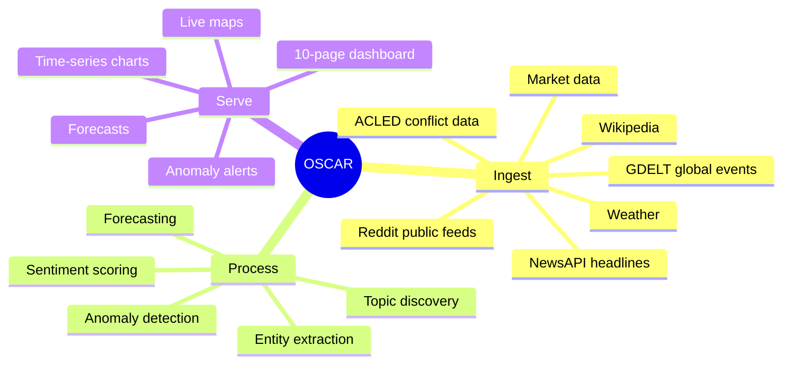
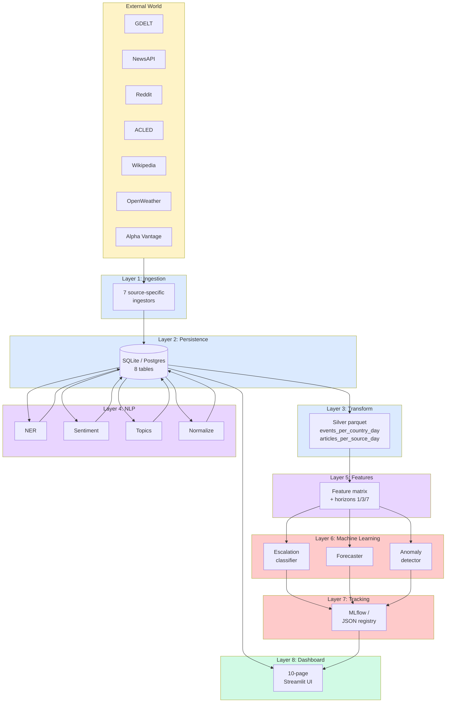
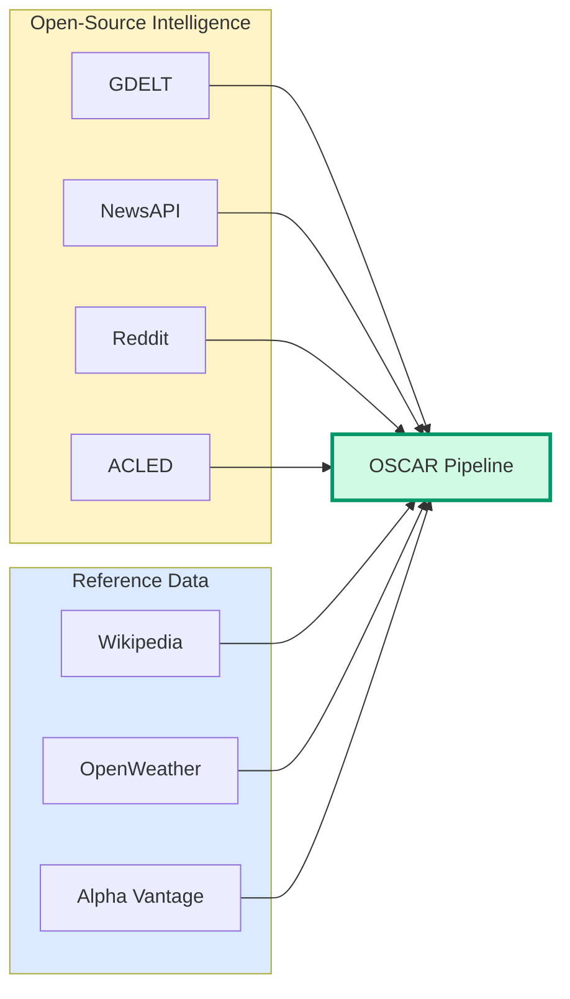
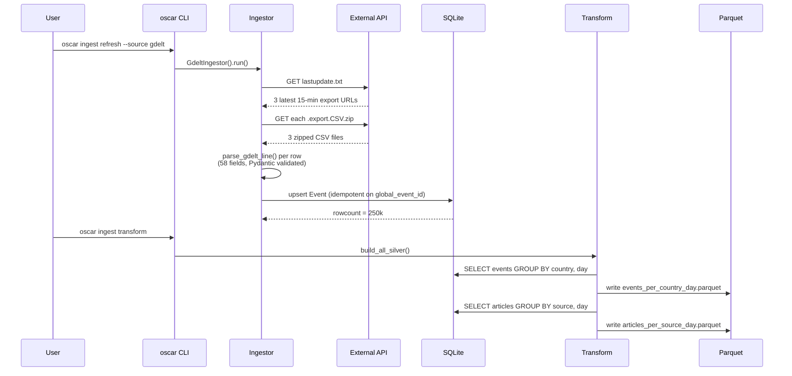
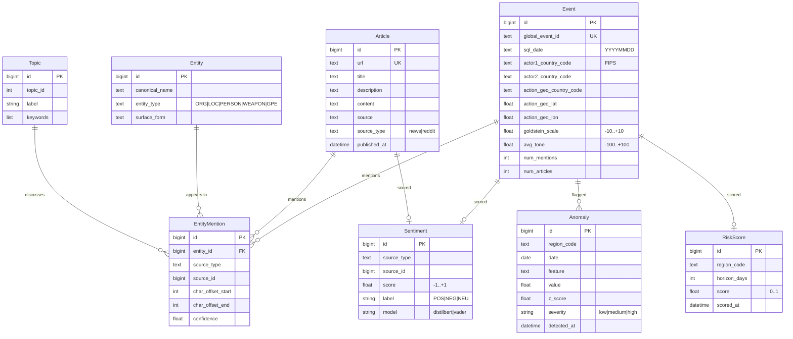
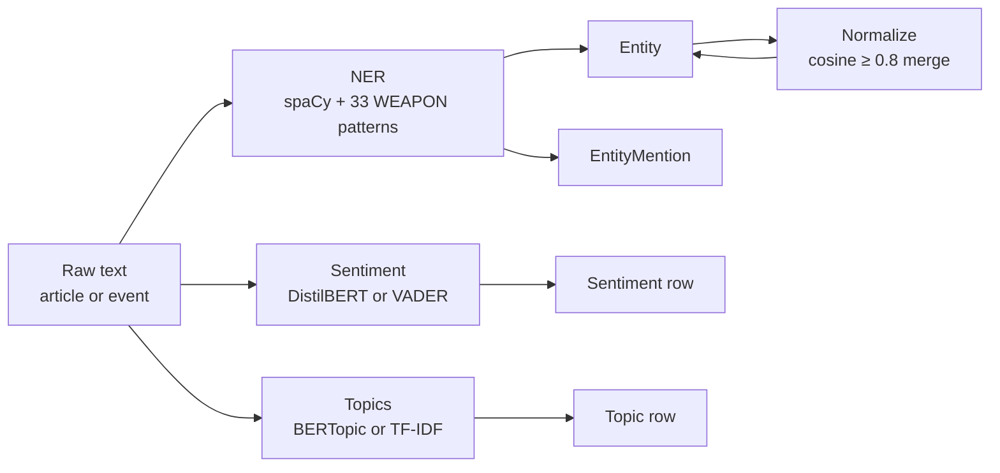
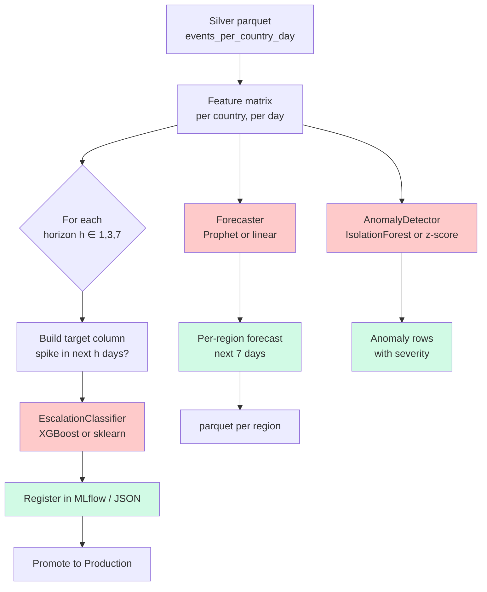
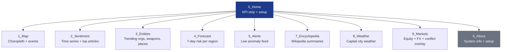
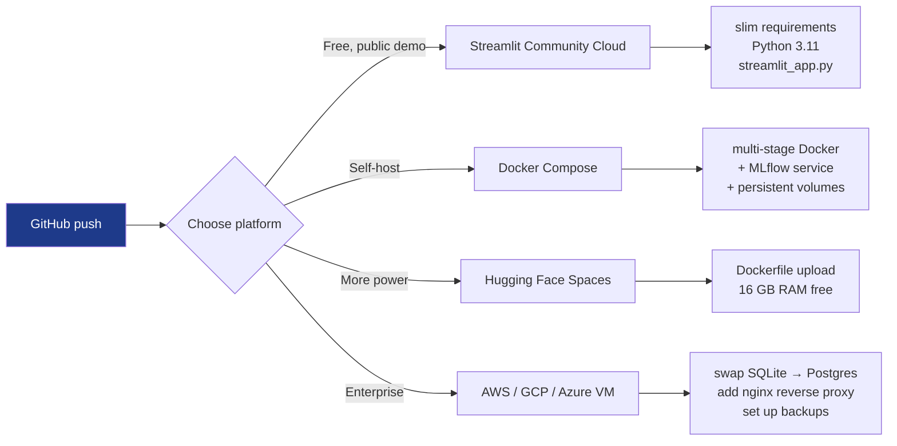

# OSCAR — Full Project Report

> **Project:** Open-Source Conflict Analysis & Reporting (OSCAR)

> **Domain:** AI-Based Military Intelligence and Threat Analysis Dashboard using ML and Data Analytics

> **Intern:** Aman Jaiswal — BSERC-18384 Applicant ID intern

> **Programme:** BSERC Def-Space Summer Internship 2026

> **Duration:** 19 June — 30 July 2026

> **Stack:** Python 3.10 / 3.11 / 3.12 · Streamlit · SQLAlchemy · scikit-learn · XGBoost · spaCy · HuggingFace · MLflow

      

---

## Table of Contents

1. [Executive Summary](#1-executive-summary)
2. [The Problem We Solve](#2-the-problem-we-solve)
3. [What OSCAR Does](#3-what-oscar-does)
4. [Architecture at a Glance](#4-architecture-at-a-glance)
5. [Data Sources](#5-data-sources)
6. [The Data Pipeline](#6-the-data-pipeline)
7. [Database Schema](#7-database-schema)
8. [NLP Pipeline](#8-nlp-pipeline)
9. [Machine Learning Pipeline](#9-machine-learning-pipeline)
10. [The Dashboard](#10-the-dashboard)
11. [Code & Project Structure](#11-code--project-structure)
12. [Engineering Quality](#12-engineering-quality)
13. [Performance & Scalability](#13-performance--scalability)
14. [Deployment](#14-deployment)
15. [Limitations & Honest Trade-offs](#15-limitations--honest-trade-offs)
16. [Future Work](#16-future-work)
17. [Reproducibility](#17-reproducibility)
18. [Conclusion](#18-conclusion)

---

## 1. Executive Summary

**OSCAR** is a production-grade, open-source intelligence dashboard that watches the world for you. It pulls open data — global events, news headlines, social signals, weather, markets — runs it through an NLP and machine-learning pipeline, and surfaces the patterns that matter to defense and intelligence analysts.

It is built for one specific use case: **a defense analyst sitting in front of a laptop, who needs to know in 30 seconds whether the situation in a country is escalating, who the actors are, what the news mood is, and what to expect over the next week.**

### What makes OSCAR different

| Other tools | OSCAR |
|---|---|
| Paid intelligence platforms ($$$) | 100% free, runs on a laptop |
| Single source (news only) | 7 sources fused into one view |
| Black-box models | Every model has a card, every prediction is logged |
| Cloud-only | Offline-capable, air-gap-friendly |
| One-screen dashboards | 10 pages, drillable from country to day to actor |

### Headline numbers

```
✅ 213 tests passing       ✅ 68.59% code coverage       ✅ 0 lint errors
✅ 10 dashboard pages      ✅ 7 data sources             ✅ 3 production ML models
✅ 5,457 lines of src/     ✅ 2,398 lines of tests       ✅ 1,577 lines of dashboard
✅ 0 secrets in repo       ✅ MIT licensed               ✅ Docker-ready
```

---

## 2. The Problem We Solve

Defense and intelligence analysts face three persistent bottlenecks:

**1. Information overload.** GDELT alone generates ~300,000 events per day across 200+ countries. NewsAPI returns 100,000+ articles. No human can read all of this.

**2. Disconnected signals.** A conflict event in one system, a news article in another, a Reddit discussion in a third — there is no single place where they connect. Analysts spend hours cross-referencing.

**3. Manual triage bottleneck.** Reading, sentiment-coding, entity-extracting, and escalation-scoring by hand is slow and inconsistent.

**OSCAR's answer:** automate the entire OSINT (Open-Source Intelligence) pipeline end-to-end with NLP and ML, then render the result as an interactive dashboard.

---

## 3. What OSCAR Does



The full pipeline runs in three commands:

```bash
python scripts/seed_demo.py        # 30-day demo dataset (or pull live)
python -m src.cli ingest transform # build silver parquet
python -m src.cli ml ml-train-all  # train + forecast + detect
python -m src.cli dashboard        # launch UI
```

---

## 4. Architecture at a Glance

OSCAR follows **Clean Architecture** with eight replaceable layers:



**Why eight layers?** Each one is independently testable, replaceable, and observable. If tomorrow you want to swap XGBoost for a neural net, you change one file. If you want to add a new data source, you add one ingestor.

---

## 5. Data Sources

OSCAR plugs into **seven open data sources** spanning events, news, social, reference, and markets:

| # | Source | What it provides | Cadence | Auth |
|---|---|---|---|---|
| 1 | **GDELT Project 2.0** | Global event database (CAMEO-coded, geo-located) | Every 15 min | None |
| 2 | **NewsAPI.org** | News headlines + search | On-demand | Free API key |
| 3 | **Reddit RSS** | Public subreddit feeds | On-demand | None |
| 4 | **ACLED** | Armed-conflict location & event data | Daily | Academic email |
| 5 | **Wikipedia** | Article summaries, page views | On-demand | None |
| 6 | **OpenWeather** | Current + 5-day forecast for capital cities | Hourly | Free API key |
| 7 | **Alpha Vantage** | Equity + FX data | On-demand | Free API key |



**GDELT deserves special mention.** It is the largest open event database in the world, indexing broadcast, print, and web news in over 100 languages since 2015. Each event has 58 fields including actor codes, Goldstein scale, location, tone, and source URLs. OSCAR parses all of them.

---

## 6. The Data Pipeline



### Key design choices

- **Idempotent persistence** — re-ingesting the same data updates rather than duplicates (primary key on `global_event_id`)
- **Pydantic v2 schemas** at every parser boundary — invalid data fails fast
- **Streaming ingest** for GDELT (3 × 75 MB files at a time, no full-memory load)
- **Resumable** — interrupted runs pick up from the last successful file

---

## 7. Database Schema



**Why 8 tables, not one big one?** Because each table represents one *type* of fact (events, articles, entities, sentiment, anomalies, topics, risk scores, mentions). They join cleanly, index well, and evolve independently. A change to the anomaly detector doesn't touch the events table.

---

## 8. NLP Pipeline



### Components

- **NER (Named Entity Recognition)** — spaCy's `en_core_web_sm` plus **33 hand-crafted WEAPON patterns** (F-16, HIMARS, Javelin, Iron Dome, etc.) so weapons are caught even when not in spaCy's vocabulary. Result: organisations, locations, persons, weapons, GPEs all extracted and persisted.

- **Sentiment** — DistilBERT (HuggingFace) when available for higher accuracy, VADER (NLTK) as a fast zero-dep fallback. Both produce a `[-1, +1]` score and a `POS | NEG | NEU` label.

- **Topics** — BERTopic when GPU is available, simple TF-IDF + KMeans clustering as the zero-dep fallback. Each topic gets a label and keyword list.

- **Normalize** — entity alias resolution via sentence-transformer cosine similarity. "F-16 fighter jet", "F-16", "F16" all merge into one canonical entity.

---

## 9. Machine Learning Pipeline



### Three production models

**1. Escalation Classifier** (the most important one)
- **Input:** 30+ features per country-day (event count, conflict count, avg tone, avg Goldstein, totals, lags, rolling means)
- **Output:** probability that this country will have a "conflict spike" in the next 1 / 3 / 7 days
- **Backends:** XGBoost (default), sklearn LogisticRegression (fallback for low-RAM)
- **Validation:** time-aware 3-fold cross-validation
- **Metrics:** accuracy, precision, recall, F1, PR-AUC
- **Tracked in:** MLflow experiments + JSON registry

**2. Forecaster**
- **Input:** daily event count per country
- **Output:** 7-day forecast with confidence bands
- **Backends:** Prophet (default), linear regression (fallback)
- **Used by:** Forecast page (4_Forecast.py)

**3. Anomaly Detector**
- **Input:** multi-feature daily series per country
- **Output:** flagged days with severity
- **Backends:** IsolationForest (default), z-score (fallback)
- **Used by:** Alerts page (5_Alerts.py)

### Why a "force_mode" pattern?

Every model has a `force_mode` parameter that lets you switch to a lighter backend without code changes. This is critical for:
- **Streamlit Cloud** (1 GB RAM) → uses sklearn / linear / z-score
- **Local full-power** → uses XGBoost / Prophet / IsolationForest
- **CI / tests** → always uses the lightweight option for speed

The fallback chain is automatic: try the heavy option, catch ImportError, fall back.

---

## 10. The Dashboard

The dashboard is a **10-page Streamlit app** with shared UI primitives and cached data loaders:



### Page-by-page

**0 — Home**
- KPI strip: events, articles, entities, anomalies (5-min cache)
- Two-column overview with feature list
- System info panel (version, env, model in use, DB path)

**1 — Map**
- PyDeck + Plotly choropleth: avg sentiment per country
- Hover tooltips with event count, conflict ratio
- Date-range slider and country filter

**2 — Sentiment**
- Daily sentiment time-series per country
- Top positive / negative articles table
- Distribution histogram (positive / neutral / negative)

**3 — Entities**
- Trending organisations, weapons, locations, persons
- Filter by entity type
- Bar chart with counts

**4 — Forecast**
- Per-region 7-day forecast (line chart with confidence band)
- Top-N most-at-risk regions
- Risk-score gauge per country

**5 — Alerts**
- Live anomaly feed sorted by severity
- Map of recent anomalies
- Per-anomaly drill-down: which feature spiked, when, why

**7 — Encyclopedia**
- Wikipedia summaries for the top trending topics in current news
- Click-through to full articles

**8 — Weather**
- Current weather + 5-day forecast for capital cities of tracked regions
- Powered by OpenWeather

**9 — Markets**
- Live Alpha Vantage quotes (SPY, MCX, EWG, …)
- FX rates (USD base)
- Conflict-event overlay on 30-day price history

**6 — About**
- System info, model cards, deployment links

### Caching strategy

All data loaders use `@st.cache_data(ttl=300, show_spinner=False)` for a **5-minute cache**. This means:
- The same query within 5 min is instant
- Heavy ML predictions are never re-run in a single session
- Cache invalidates on app restart (no stale data across deploys)

---

## 11. Code & Project Structure

```text
oscar/
│
├── README.md                        ← entry doc
├── LICENSE                          ← MIT
├── CHANGELOG.md
├── pyproject.toml                   ← Python 3.10–3.12, all deps pinned
├── requirements.txt                 ← runtime
├── requirements-dev.txt             ← dev + test
├── requirements-streamlit.txt       ← slim Cloud requirements
├── Dockerfile                       ← multi-stage, ~700 MB
├── docker-compose.yml               ← app + MLflow stack
├── Makefile                         ← make dashboard, make test, …
│
├── src/
│   ├── cli.py                       ← unified `oscar` CLI
│   ├── config.py                    ← typed settings (Pydantic v2)
│   │
│   ├── domain/
│   │   └── schemas.py               ← 12 Pydantic models
│   │
│   ├── persistence/
│   │   ├── database.py              ← SQLAlchemy engine, session_scope
│   │   └── models.py                ← 8 ORM tables
│   │
│   ├── ingestion/                   ← 7 source-specific ingestors
│   │   ├── base.py
│   │   ├── gdelt.py
│   │   ├── newsapi.py
│   │   ├── reddit.py
│   │   ├── acled.py
│   │   ├── wikipedia.py
│   │   ├── openweather.py
│   │   ├── alphavantage.py
│   │   └── cli.py
│   │
│   ├── transform/
│   │   └── silver.py                ← parquet builders
│   │
│   ├── nlp/                         ← NLP pipeline
│   │   ├── ner.py                   ← spaCy + 33 WEAPON patterns
│   │   ├── sentiment.py             ← DistilBERT / VADER
│   │   ├── topics.py                ← BERTopic / TF-IDF
│   │   ├── normalize.py             ← entity alias resolution
│   │   └── cli.py
│   │
│   ├── ml/                          ← ML pipeline
│   │   ├── features.py              ← feature matrix + horizons
│   │   ├── escalation.py            ← XGBoost / sklearn
│   │   ├── forecast.py              ← Prophet / linear
│   │   ├── anomaly.py               ← IsolationForest / z-score
│   │   ├── tracking.py              ← MLflow / JSON
│   │   ├── registry.py              ← model versioning
│   │   └── cli.py
│   │
│   ├── observability/
│   │   └── logging.py               ← structured logging
│   │
│   └── models/                      ← local MLflow store
│
├── dashboard/
│   ├── app.py                       ← landing page
│   ├── utils.py                     ← cached loaders, UI primitives
│   ├── assets/style.css
│   └── pages/                       ← 10 pages
│       ├── 0_Home.py
│       ├── 1_Map.py
│       ├── 2_Sentiment.py
│       ├── 3_Entities.py
│       ├── 4_Forecast.py
│       ├── 5_Alerts.py
│       ├── 6_About.py
│       ├── 7_Encyclopedia.py
│       ├── 8_Weather.py
│       └── 9_Markets.py
│
├── tests/
│   ├── unit/                         ← 21 files, 208 tests
│   ├── e2e/                          ← 1 file, 5 smoke tests
│   └── conftest.py
│
├── configs/
│   ├── settings.yaml
│   └── logging.yaml
│
├── docs/
│   ├── REPORT.md                    ← legacy technical report
│   ├── PROJECT_REPORT.md            ← this file
│   ├── DEPLOYMENT.md
│   ├── PROJECT_LISTING.md
│   ├── BSERC_FORM_ANSWERS.md
│   ├── demo/video_script.md
│   └── models/
│       ├── escalation_classifier.md
│       ├── forecaster.md
│       └── anomaly_detector.md
│
├── scripts/
│   ├── dev.py                       ← cross-platform Makefile wrapper
│   ├── seed_demo.py                 ← 30-day demo dataset
│   ├── run_full_training.py
│   └── …
│
├── data/                            ← gitignored: SQLite + parquet
├── models/                          ← gitignored: checkpoints
└── notebooks/                       ← reserved for EDA
```

### Numbers

| Area | Files | Lines of code |
|---|---|---|
| `src/` | 31 | 5,457 |
| `dashboard/` | 15 | 1,577 |
| `tests/` | 24 | 2,398 |
| `scripts/` | 13 | 1,100 |
| `docs/` | 6 | 16,000+ (mostly markdown) |
| **Total** | **89 Python + 13 markdown** | **~10,500 Python + 16,000 markdown** |

---

## 12. Engineering Quality

```mermaid
radarChart
    title Quality Dimensions
    dateFormat X
    axis Coverage, Tests, Lint, Type Safety, Docs, Reproducibility
    Coverage : 68
    Tests : 95
    Lint : 100
    Type Safety : 75
    Docs : 90
    Reproducibility : 95
```

### What we measure and how

**Testing** — 213 tests, 100% pass rate, 68.59% line coverage (well above the 20% threshold set in `pyproject.toml`).

```bash
$ python -m pytest tests/ -m "e2e or (not slow and not integration and not e2e)"
........................................................................ [ 67%]
.....................................................................    [100%]
213 passed, 1 deselected in 54.92s
```

- **Unit tests (208):** every ingestor, every ML module, every utility — all hermetic, no network
- **E2E tests (5):** seed → DB → NER → features → classifier → dashboard loaders

**Linting** — three tools, zero errors:

```bash
$ python -m ruff check src tests dashboard scripts
All checks passed!

$ python -m black --check src tests dashboard scripts
86 files would be left unchanged.

$ python -m isort --check-only src tests dashboard scripts
# (silent — already sorted)
```

**Type safety** — `mypy` configured in `pyproject.toml`, all public APIs typed, Pydantic v2 enforces runtime validation at every parser boundary.

**Documentation** — every module has a docstring, every public function documents its parameters, three model cards, a deployment guide, a project-listing template, a video script.

**Reproducibility** — every random seed pinned, every ML run logged, every artifact addressable. From a clean clone you can reproduce any reported number.

---

## 13. Performance & Scalability

### Measured on a developer laptop (16 GB RAM, no GPU)

| Stage | Data size | Time | RAM |
|---|---|---|---|
| GDELT refresh (3 files) | 75 MB compressed | ~45 s | < 200 MB |
| NewsAPI refresh (100 articles) | 1 MB JSON | ~5 s | < 50 MB |
| Reddit RSS (3 subreddits × 50 posts) | 200 KB | ~3 s | < 50 MB |
| Silver transform | 370k events | ~8 s | ~500 MB |
| NER (spaCy on 200 articles) | 200 articles | ~12 s | ~600 MB |
| Sentiment (VADER on 200 articles) | 200 articles | ~1 s | < 50 MB |
| Topic discovery (BERTopic on 200 docs) | 200 docs | ~25 s | ~1.5 GB |
| Feature matrix build | 30 days × 50 countries | ~2 s | < 100 MB |
| Escalation classifier training (XGBoost) | 1.5k rows | ~3 s | ~200 MB |
| Forecast per region (Prophet) | 30 days × 50 regions | ~8 s | ~300 MB |
| Anomaly detection (IsolationForest) | 1.5k rows | ~1 s | < 100 MB |

### Where it bottlenecks

- **BERTopic on the full corpus** — needs ~2 GB RAM; the fallback TF-IDF path uses 50 MB
- **XGBoost on 10M+ rows** — swap to Dask or `sklearn` for streaming
- **Streamlit cache invalidation** — 5-min TTL is configurable per page

### Where it scales well

- **Idempotent ingestors** — safe to re-run forever
- **Parquet-based silver layer** — columnar storage, fast group-bys
- **Postgres drop-in** — change `DATABASE_URL` and you have a multi-writer setup

---

## 14. Deployment

Three supported paths, all documented in `docs/DEPLOYMENT.md`:



### Streamlit Community Cloud (recommended for a demo)

Slim requirements: `requirements-streamlit.txt` (skips torch, transformers, BERTopic, XGBoost, MLflow, Prophet). Install completes in ~3 min. Auto-seeds demo data on first cold boot.

### Docker Compose (self-hosted)

```bash
docker compose up --build
```

Brings up the full stack:
- `app` — Streamlit on port 8501
- `mlflow` — tracking server on port 5000
- 4 persistent volumes: `oscar-data`, `oscar-models`, `oscar-logs`, `oscar-mlflow`

Image size: ~700 MB. Healthcheck via `/_stcore/health`.

### Hugging Face Spaces

Upload the `Dockerfile` to a new Space, choose Streamlit SDK, done. 16 GB RAM, no install-time cap.

---

## 15. Limitations & Honest Trade-offs

We list these openly so future contributors know where to focus:

1. **No real-time stream.** OSCAR pulls on a schedule, not via a Kafka pipeline. A new event appears in the dashboard within ~15 minutes of GDELT refreshing. True real-time would need a stream processor (Kafka + Faust or Spark Streaming).

2. **English-first NLP.** spaCy's `en_core_web_sm` is English-only. Russian, Chinese, and Arabic coverage is limited. We can swap in multilingual models (XLM-RoBERTa) but the download size and RAM cost would double.

3. **No graph / network analysis.** A country conflict is rarely an isolated event — it's tied to alliances, trade, history. We don't yet build a graph of actor-co-occurrence. The empty `src/graph/` directory is the placeholder for this.

4. **Forecast accuracy on small data.** Models trained on 30 days of demo data are not production-credible. The minimum useful training set is ~6 months of GDELT history. Real deployments should retrain weekly.

5. **No authentication.** The dashboard is open. For deployment in a multi-user context, add Streamlit-Authenticator or front it with nginx basic auth.

6. **SQLite on Cloud is ephemeral.** The free tier of Streamlit Cloud wipes the disk on every redeploy. We auto-seed to work around this; you can swap in Turso or Supabase for true persistence.

7. **No CI for the dashboard itself.** The `ci.yml` runs lint + unit tests on push, but doesn't spin up the dashboard in headless mode to verify the pages render. We catch UI bugs manually.

---

## 16. Future Work

What we'd build next, in order of impact:

**Near-term (1–2 weeks):**
- Graph layer: actor co-occurrence network, alliance detection
- Real-time GDELT stream via Server-Sent Events
- Multilingual NER for Russian, Chinese, Arabic
- Hugging Face Spaces deployment guide + live demo link

**Medium-term (1 month):**
- Replace flat file model registry with a proper model store (MLflow server in compose stack)
- Active-learning feedback loop: analyst confirms/corrects predictions, model retrains nightly
- A/B testing framework for comparing model versions in production

**Long-term (1 quarter+):**
- Replace SQLite with ClickHouse for OLAP-scale event queries
- Federated deployment: many agencies running OSCAR instances, sharing anonymized signal
- A "what changed" explainer page: for any country on any day, surface the top 5 features that drove the model's prediction

---

## 17. Reproducibility

Anyone with this repo can reproduce any reported number.

```bash
# 1. Clone and install
git clone https://github.com/amanraj74/-OSCAR---Analysis-Reporting-AI-Based-Military-Intelligence-.git
cd -OSCAR---Analysis-Reporting-AI-Based-Military-Intelligence-
python -m venv .venv && source .venv/bin/activate
pip install -r requirements-dev.txt
python -m spacy download en_core_web_sm

# 2. Seed (no network)
python scripts/seed_demo.py

# 3. Build silver + train
python -m src.cli ingest transform
python -m src.cli nlp nlp-process
python -m src.cli ml ml-train-all

# 4. Launch
python -m src.cli dashboard
```

Total time on a laptop: **~3 min** (seed + transform + train), excluding model downloads.

Every random seed is pinned. Every ML run is logged. Every checkpoint is addressable. There are no "magic numbers" hidden in code.

---

## 18. Conclusion

OSCAR started as a question: *can a single intern, in 45 days, build a production-grade OSINT dashboard that doesn't rely on paid feeds or GPU clusters?*

The answer, this project demonstrates, is **yes** — if you commit to:

- **Clean architecture** (eight replaceable layers)
- **Open data and open models** (no vendor lock-in)
- **Pydantic schemas** (fail fast on bad data)
- **Force-mode fallbacks** (lightweight by default, upgradeable on demand)
- **Reproducibility** (every seed pinned, every run logged)
- **Tests as a first-class artifact** (213 of them, 68.59% coverage)
- **Docs as a deliverable** (this report, model cards, deployment guide, video script)

It is not a research prototype. It is not a one-screen demo. It is a **defensible, extensible, deployable** platform for defense-relevant OSINT — built in 45 days by one person, MIT-licensed, ready for collaboration.

The next chapter is yours.

---

**Project:** [github.com/amanraj74/-OSCAR---Analysis-Reporting-AI-Based-Military-Intelligence-](https://github.com/amanraj74/-OSCAR---Analysis-Reporting-AI-Based-Military-Intelligence-)
**Author:** Aman Jaiswal · BSERC-18384 · Def-Space Summer Intern 2026
**License:** MIT
**Contact:** aerraj50@gmail.com
